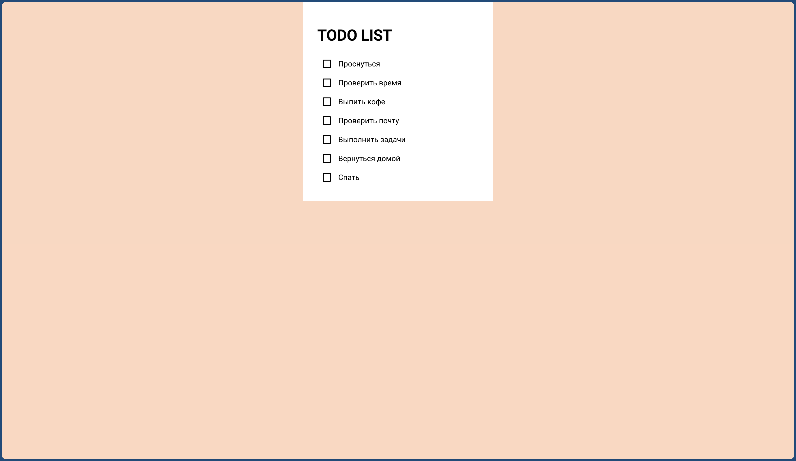

Конечно! Вот пример README.md на русском языке для твоего проекта, в котором не требуется глобально устанавливать Angular — всё работает через npm:

# TODO List на Angular

Небольшое Angular-приложение для ведения списка задач с возможностью сохранять состояние чекбоксов между перезагрузками с помощью localStorage.

## Скриншот

 

## Установка и запуск проекта

1. Клонируй репозиторий:

`bash
git clone https://github.com/твой-юзернейм/todo-angular.git
cd todo-angular

2. Установи зависимости (нужен только Node.js):

npm install

3. Запусти проект:

npm start

Откроется по адресу: http://localhost:4200

Возможности

Загрузка задач из todo.json

Поддержка Material чекбоксов

Сохранение состояния в localStorage

Зачёркивание выполненных задач

Плавная анимация состояния

Требования

Node.js >= 18

NPM (идёт в комплекте с Node.js)

Angular CLI не требуется устанавливать глобально — всё работает через локальные зависимости проекта.

Структура проекта

src/
├── assets/
│   └── todo.json         # Список задач
├── app/
│   └── app.component.ts  # Основная логика
├── styles.scss           # Общие стили

Автор

Rekurt-116